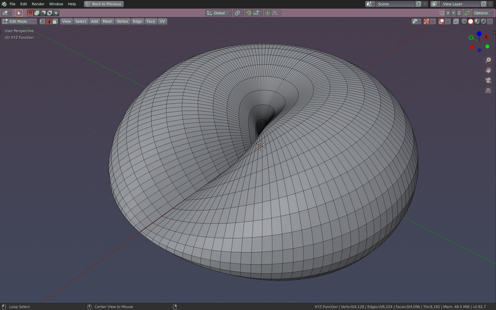
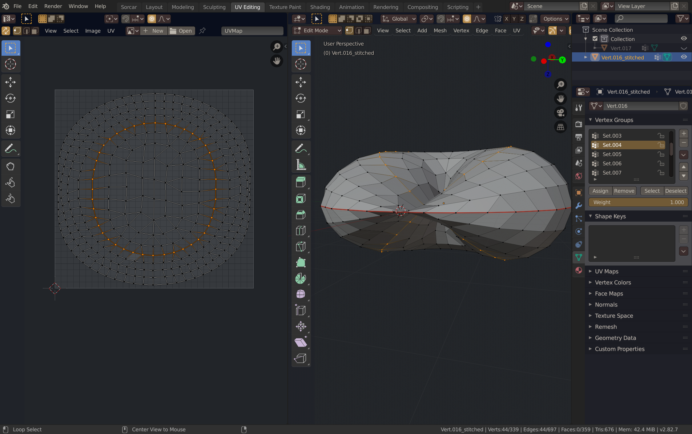

# Parametric Surface Crochet Diagram Generators

This is a collection of scripts created for the purpose of generating crochet patterns of parametric surfaces. Parametric surfaces can be generated easily in Blender and Octave. However, the meshes they produce by default are unsuitable for use as crochet patterns; in particular, adjacent vertices are not necessarily equidistant. An example of this is seen in , which shows the contraction of vertices in edge loops near the center of this embedding of a projective plane as a parametric mesh object. In general, to form a physical object consistent in proportion to the desired embedded surface, crochet stitches must be the same size. These scripts automate much of the modeling work done in obtaining a suitable mesh for use as a crochet pattern.

## Octave Scripts

These are preview scripts for use in GNU Octave/MATLAB. They are a precursor to the blender scripts, included as instructive examples and demonstration of the crochet workflow.

## crochet.py

This script generates a surface mesh from a given from a parametric equations in three dimensions and modifies its edge loops to ensure that adjacent vertices on each edge loop are equidistant. The given equations generate an embedding of a torus, for example. Vertices of this mesh are sorted into vertex groups by their edge loops. Then for each edge loop (vertex group), an edge is formed from each vertex in that edge loop to the nearest vertex in each adjacent edge loop, by Euclidean distance. One may specify the desired aspect ratio of the stitch desired, in order to suit their particular materials and choice of stitch. A suitable diagram may then be obtained by UV-unwrapping the mesh, as shown for example in . Each edge loop in the UV-map then corresponds to a single crochet round. Notably, the edge loops of the embedded projective plane are self-intersecting, which is realized in a weaving pattern of crochet rounds.
